# Linux Basic

このページでは、Linuxの基礎知識を解説します。

まずは、パソコンを触って慣れましょう！

パソコンは「習うより慣れろ」です。壊しても大丈夫なので、いろいろ触って見よう！


## Linuxとは？

簡単に言えば、"Windows"や"Mac"のような種類のことです。

難しい言葉を使えば、"OS(Operating System)"というものになります。

Windowsにも

- Windows 10
- Windows 8
- Windows vista

のように、いろいろな種類があるように、Linuxにも様々な種類があります。

これをディストリビューションといい、みなさんのパソコンには[CentOS]がインストールしてあります。他にも、[Fedora]や[Debian]、[Ubuntu]や[Linux Mint]などもありその数は100を超えると言われています。

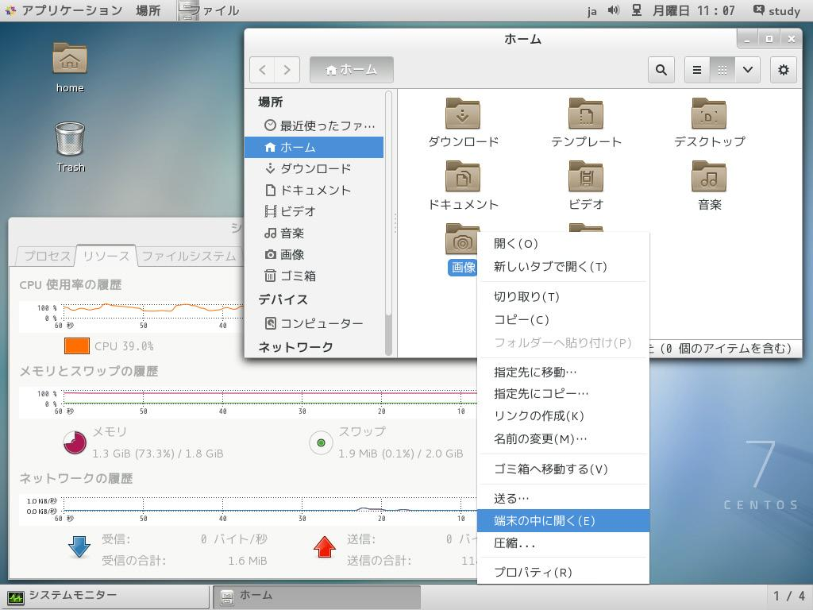

**CentOS**の例（みなさんのパソコン）

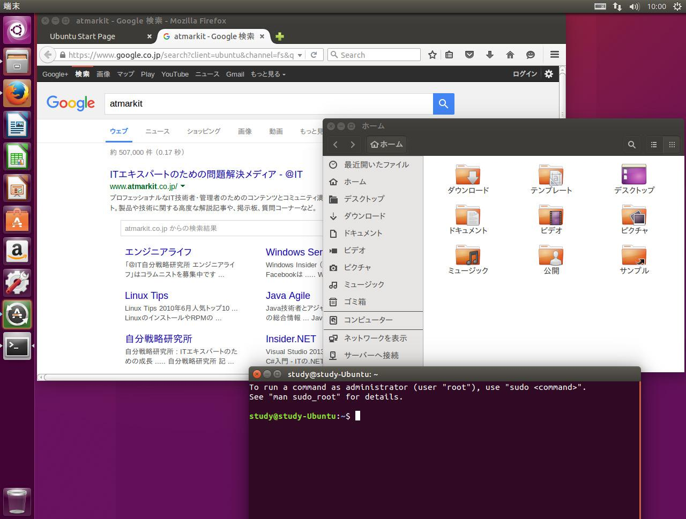

**Ubuntu**の例（ウプントゥと発音します。）

```eval_rst

.. note::

    わからないことは「Centos OOOO インストール」などで検索すると答えが出てくるでしょう。

```


## GUIとCUI

私たちが Windowsで慣れ親しんでいるような、ウィンドウを表示してマウスで操作するスタイルが
「GUI ( Graphical User Interface )」です。

 GUI に対して、キーボードでコマンド(command :命令)を入力し、 その結果を文字で受け取るスタイルが「 CUI ( Character User Interface )」になります。

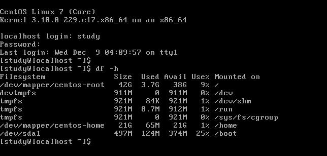

CUIの一例（映画とかで見るハッカーがパソコンを操作している画面をイメージしてください）


Linuxはマウスをつかって操作することもできますが、キーボードを使ってコマンドを入力することが一般的になってくるでしょう。

ここでは、CUIの使い方を初心者の方でもわかるように解説をしていきますが、わからないことは簡単なことでも先輩に聞いて見ましょう。

先輩たちは教えたがりなので優しく教えてくれます。


## 端末：Terminal

実際問題、CUIのみを使って操作することはほとんどなく、GUI 環境でコマンドラインを使用したい場合は、「端末ウィンドウ」を使用します。

以下のように、「端末」を起動してみましょう！


「study」や「localhost」の名前は異なりますが、カーソルが点滅している白い画面が出てきたでしょうか？

これは「端末」や「ターミナル」と呼ばれ、GUIからCUIを操作で来る優れものです。以降基本的に研究や輪講の課題はこのターミナルで行うことになります。


## コマンドを実行しよう

ここでコマンドを入力して[ Enter ]キーを押すと、実行結果が表示されます。試しに、`df`と入力して[ Enter ]キーを押して見ましょう。（以下の図を参照。）

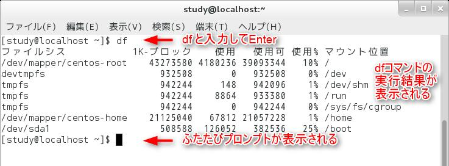

似たような画面が出てきたら成功です。ちなみに`df`はディスク使用量を表示するコマンドです。


### （応用）プロンプトの読み方

ターミナルにはさまざまな情報が表示されています。例えば、今回使用している画面では「 [study@localhost ~]$ 」 と表示されています。

この [] の中に書かれている内容は「 ユーザー名 @ ホスト名 カレントディレクトリ」という意味になります。

「 ~ (チルダ)」記号は、ホームディレクトリという意味です。


最後の記号は、 いわばコマンドプロンプトの 目印 のようなもので、一般ユーザーで実行している場合は「 $ 」記号が表示されるように設定されています 。

 root ユーザーという特別なユーザーで実行している場合は「 # 」という記号が表示されます。

つまり、
「 [study@localhost ~]$ 」というプロンプトからは「現在、一般ユーザーとしてコマンドラインを使っており、 study という名前で localhost というホストにログインしている。カレントディレクトリはホームディレクトリ」ということが分かります。

------

皆さんにとって重要なのは、**カレントディレクトリ**ぐらいです。ディレクトリはWindowsで言うならばフォルダを意味し、今現在自分がどこのフォルダにいるかということを示します。

**ホームディレクトリ**とはWindowsの「PC」フォルダにほぼ当たります。つまり以下の２つの画像は両方ともホームディレクトリにいるという意味です。

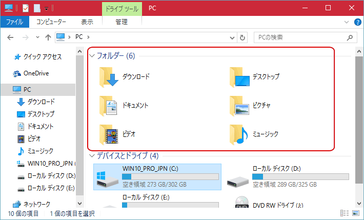


## 基本的なコマンドを練習しよう

そもそも覚えておくべきコマンドに`ls`や`cd`、`mkdir`などがあります。

ここではその使い方を説明します。

まずは、上を参考にターミナルを開きましょう。


### `pwd`

ターミナルでは常に 自分がどのディレクトリにいるか を意識する必要があります。これは`pwd`というコマンドで確認できます。

ターミナルに`pwd`と入力し、[Enter]キーを押してみましょう。

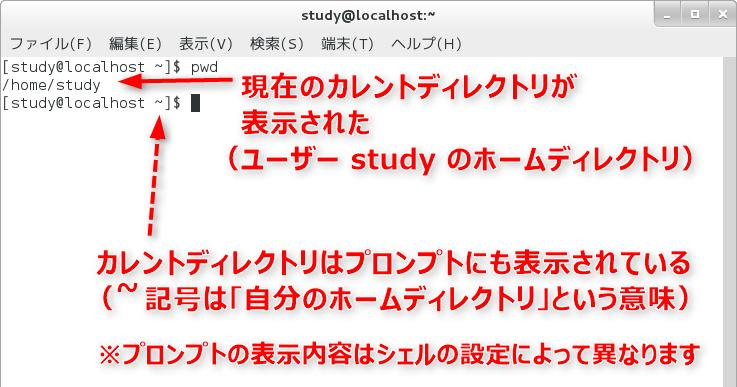

似たような表示になりましたか？これは自分が今`/home/study` という場所に居ることを示しています。

(先程も言いましたが、`~`はホームディレクトリを表す特別な記号で、`/home/study`と全く同じ意味です。)


### `ls`

カレントディレクトリのファイルやディレクトリが一覧表示されます。Windowsのファイルを開いて、どんなファイルがあるかな〜と眺めているのと同じですね。上と同様にターミナルに`ls`と入力し、[Enter]キーを押してみましょう。


英語ではなく、日本語で「デスクトップ」「ドキュメント」と表示さてれているかもしれませんが、同じことです。

------

またコマンドには様々なオプションをつけて実行することができます。オプションは`ls -l`のように`コマンド　-オプション`　と入力し、実行します。

同様にターミナルに`ls -l`と入力し、[Enter]キーを押してみましょう。

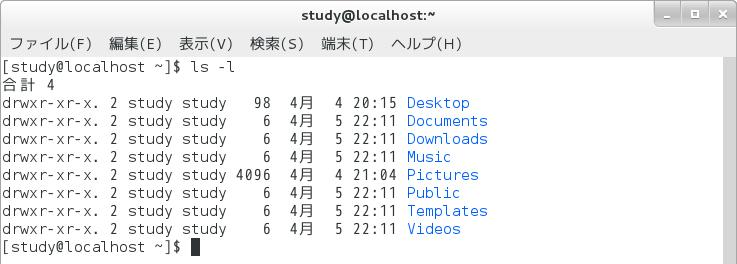

`ls -l`の`-l`オプションは、ファイルの属性や所有者、最終更新日などの詳細を表示するオプションです。


### `cd`

カレントディレクトリは「 cd 」コマンド( Change Directory )を使って、「 `cd ディレクトリ名`」で移動すること
ができます。

例えば、 カレントディレクトリ下の「 Pictures 」ディレクトリに移動する場合は、「 `cd Pictures` 」とします。

（日本語環境の方は`cd ピクチャ−`だと思われる。）

なお、このときに 「 cd P 」 まで入力して [ Tab ] キーを押すと、ディレクトリ名が補完されて 「 `cd Pictures/` 」
と自動で入力されるので「 cd P 」→[ Tab ]キー→[ Enter ]キーで移動できます。

```shell
[study@localhost ~]$ cd Pictures
[study@localhost Pictures]$
```

このように、＄の前の表示が変わっただろうか？これは自分が今`Pictures`ディレクトリにいることを示している。

この状態で、今居るディレクトリと表示する`pwd`コマンドを使えば、

```shell
[study@localhost Pictures]$ pwd
/home/study/Pictures
[study@localhost Pictures]$
```

と、表示されるだろう。

------

また、今居るディレクトリは`.`で、一つ上のディレクトリは`..`で表すことができる。

つまり、一つ上のディレクトリに行きたいときは`cd ..`で移動できる。

（慣例的に`cd ../`とする人が多いが同じことである。）

`Pictures`ディレクトリからひとつ上のホームディレクトリに戻ってみよう

```shell
[study@localhost Pictures]$ cd ../
[study@localhost ~]$ pwd
/home/study
```

ホームディレクトリにもどることができた。


### `mkdir`

これは、新しいディレクトリを作成するコマンドです。

Windowsでの「新しいフォルダの作成」と同じです。

使い方は、`mkdir 新しいディレクトリ名`です。

ホームディレクトリに、`test`というディレクトリを作成し、そこに移動してみましょう。

```shell
[study@localhost ~]$ mkdir test
[study@localhost ~]$ ls #何があるか確認してみる。
...................... test #testがどこかにあるはず。
[study@localhost ~]$　cd test
[study@localhost test]$ pwd
/home/study/test
```

------

これまでにも何度か登場してきた「ディレクトリ」という言葉を、 ここであらためておさらいしましょう。

 コンピュータではさまざまなデータを扱いますが、これらは基本的に全て「ファイル」として HDD などの記憶
媒体に保存されています。そして、これらのファイルがどこにあるかを整理したものが 「ディレクトリ ( directory ) になります。

 ディレクトリは階層化されています。つまり、ディレクトリの中にディレクトリがあり、そのディレクトリの中にま
たディレクトリがある......というような管理が可能になっています。

このディレクトリの中にあるディレクトリを「サブディレクトリ」と呼びます。また、 サブディレクトリ側から見た場合、自分自身の 1 つ上の階層のディレクトリを「親ディレクトリ」と呼びます。

 ディレクトリは「 / 」記号で表します。例えば、「 home 」ディレクトリの下に「 study 」ディレクトリがあり、そ
こに「 file.txt 」というファイルがあった場合は、「 home/study/file.txt 」のように表すことができます。


## Tabキーの補完について

ここまでディレクトリ名などをタイピングしてもらってましたが、Linuxでは便利な補完機能（予測変換機能）があります。

### 補完：候補が１個しかない場合

コマンドラインでは、コマンド名、オプション、ファイル名......とたくさんの項目をキーボードで入力しますが、
この中のコマンド名とファイル名については「補完機能」を利用することができます。（予測変換のこと）

 では、実際にやってみましょう。ファイル名やコマンド名を途中まで入力したところで[ Tab ]キーを押すと続き
が補完されます。[ Tab ]キーの代わりに[ Ctrl ]+[ I ]キーを押しても OK です。

 例えば、「 ifco 」と入力して[ Tab ]キーを押すと、コマンド名が補完されて「 ifconfig 」となります。

（下の図を参照）

コマンド名の後にオプションなどを指定することを想定して、スペースも自動で入ります。


ちなみに、 ifconfig は、ネットワークインタフェースを設定したり、設定情報を参照したりするためのコマンドで
す。[ Enter ]キーを押して実行すると、ネットワークに割り当てられている IP アドレスなどを確認できます。


### 補完：候補が複数ある場合

補完候補となるコマンドが複数ある場合は、
[ Tab ]キーを押すと候補が表示される代わりにビープ音が鳴ります(※音が出るかどうかは設定によって異なります)。

もう一度[ Tab ]キーを押すと候補が一覧表示されるので、続きの文字を入力して再度[ Tab ]キーを押しましょう。


補完候補が多過ぎる場合は「 Display all 111 possibilities ?( y or n )」のように確認メッセージが表示され
ます。[ y ]キーで全ての候補を表示するか、[ n ]キーで補完を中断します。


### ファイル名の補完

コマンドライン上では、コマンドと同様、ファイル名にも補完機能が働きます。例えば、「 cat 」コマンドで「 /etc/shells 」ファイルを表示したい場合( `cat /etc/shells` )「 cat /e 」まで入力して[ Tab ]キーを押すと「 cat /etc/ 」まで補完され、続いて「 she 」と入力して[ Tab ]キーを押すと続きが補完されます。


## コマンドの編集

コマンドラインは、左右の矢印キー([←][→])やショートカットキーで編集できます。例えば、「 cat /etc/shells 」まで入力した後で、 cat コマンドに「 -n 」オプションを付けたくなったならば、キー操作で cat の後ろまで戻って「 -n 」を入力して[ Enter ]キーで実行する、 というようなことができます。


以下によく使うキーボードショートカットを示しますが、無理して覚える必要はないです。

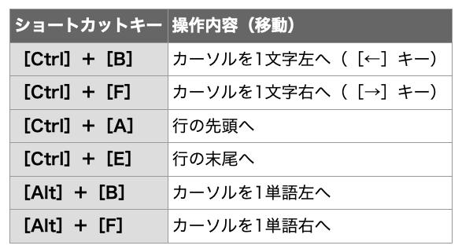

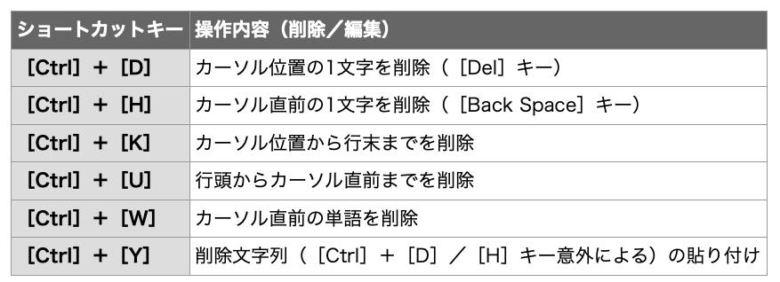


## コマンド履歴：ヒストリ機能

前にタイピングしたコマンドをもう一回使いたいといったことがありませんか？

以前入力したコマンドは、 上下の矢印キー(↑][↓]) または [ Ctrl ]+[ P ]キーと[ Ctrl ]+[ N ]キーで呼び出すことができます。これが「ヒストリ」と呼ばれる機能です。もちろん、呼び出したコマンドを編集して実行することも可能です。

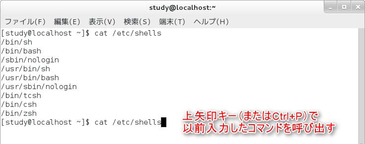

「 `history` 」コマンドでは、過去の入力したコマンドのリストを番号付きで表示することができます

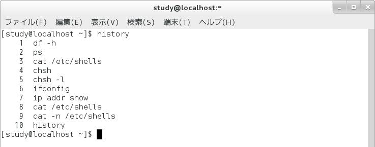


## What should I do after reading this page?

### Linuxのコマンドについてより詳しくなりたい

```eval_rst
:doc:`/LINUX/linuxcommand`
```

### vi(テキストエディタ)の使い方を知りたい

プログラムを書くためのWordみたいなもの。

```eval_rst
:doc:`/LINUX/vim_0`
```

